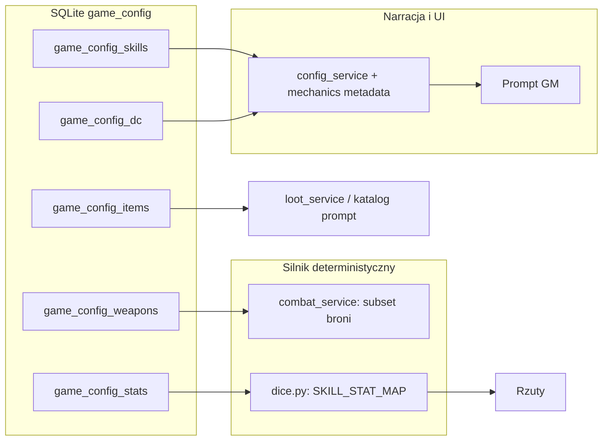

# Phase 9B — Audyt kolumn konfiguracji vs mechanika + szkic książki zasad

## Cel fazy

Przed migracjami i refaktorem **ustalić**, które pola tabel `game_config_*` są:

1. **Używane przez deterministyczny silnik** (walka, rzuty, walidacja),
2. **Używane tylko w panelu admin / imporcie-eksporcie**,
3. **Przekazywane do kontekstu narracyjnego** (LLM, opisy w promptach, metadane dla UI).

Osobno: przygotować **publiczny szkielet zasad dla graczy** (ton inspirowany Warhammer Fantasy Roleplay: procedury, przykłady), spójny z uchwałami w [`04_decisions_log.md`](04_decisions_log.md).

### Skrót: co oznacza `game_config_*`

**`game_config_*`** to wzorzec nazw **tabel konfiguracji gry** w bazie SQLite (np. `game_config_weapons`, `game_config_items`). Trzymają **definicje świata i mechanik** (broń, przedmioty, wrogowie, DC, umiejętności…) — zwykle edytowalne w panelu admin. To **nie** tabele stanu sesji (np. `characters`, `campaigns`). Gwiazdka `*` oznacza „dowolna tabela o tym prefiksie”, nie jedną konkretną tabelę.

## Zasada pracy

**Najpierw decyzje i dokumentacja, potem kod.** Ta faza nie zakłada merge’u zmian w `migrations_admin.py`, `dice.py` ani `combat_service.py` — tylko audyt i log decyzji.

## Tryb pracy zespołowej (ustalone)

- Idziemy **punkt po punkcie** wg kolejności w [`03_discussion_agenda.md`](03_discussion_agenda.md) (Sesja 0 → 1 → …). Ty odpowiadasz na pytania i zadajesz własne; ja stawiam pytania pomocnicze i — gdy widzę sensowną opcję — **jasno oznaczam sugestie** (np. „Sugestia: …”) oddzielnie od faktów z kodu.
- **Uchwały** trafiają do [`04_decisions_log.md`](04_decisions_log.md) (data, treść, konsekwencje).
- **Definicje słownikowe** (np. co znaczy „używane w grze”) — krótki akapit tutaj, w sekcji poniżej po Sesji 0.
- **Doprecyzowanie macierzy** po ustaleniach — aktualizacja [`02_code_usage_matrix.md`](02_code_usage_matrix.md) (np. kolumna X = „tylko LLM / must-implement / odrzucone na razie”).
- **Książka gracza** — tylko to, co jest w logu decyzji; szkic w [`player_rulebook/00_outline_and_tone.md`](player_rulebook/00_outline_and_tone.md) uzupełniamy, gdy rozdział ma już uchwały.

### Definicja: kiedy `game_config_*` jest „używane w grze” (Sesja 0 — **accepted**)

Dane z tabel `game_config_*` traktujemy jako **używane w grze** zawsze wtedy, gdy są potrzebne do:

1. **Twardej mechaniki** — deterministyczne zasady (walka, rzuty, walidacja, grant przedmiotów powiązany z kluczem z katalogu), **oraz**
2. **Podania LLM twardych faktów** — eksport / wstrzyknięcie do kontekstu tak, żeby model **nie halucynował** statystyk, nazw przedmiotów ani zachowań spoza katalogu.

**Przykład:** gdy postać ma dostać miecz (zakup w sklepie, nagroda od NPC, łup z zabitego wroga), opieramy się na **rekordach w bazie** (`weapon_key` / `item_key` i ich pola), a nie na dowolnym opisie bez powiązania z wierszem konfiguracji.

Pola, które **nie** wchodzą ani do mechaniki, ani do takiego „twardego” kontekstu dla LLM, audytujemy osobno (np. wyłącznie notatka w adminie, martwe pole).

## Zakres dokumentów w tym folderze

| Plik | Opis |
|------|------|
| [`01_schema_inventory.md`](01_schema_inventory.md) | Kolumny tabel konfiguracyjnych (źródło: migracje; opcjonalnie `PRAGMA` na żywej bazie) |
| [`02_code_usage_matrix.md`](02_code_usage_matrix.md) | Macierz: kolumna → ścieżka w kodzie lub „nie znaleziono w silniku” |
| [`03_discussion_agenda.md`](03_discussion_agenda.md) | Kolejność tematów dyskusji |
| [`04_decisions_log.md`](04_decisions_log.md) | Uchwały (data, treść, konsekwencje) |
| [`player_rulebook/00_outline_and_tone.md`](player_rulebook/00_outline_and_tone.md) | Szkic książki zasad dla graczy |

## Kotwice techniczne (stan na start fazy — do weryfikacji)

- **Broń w walce:** [`backend/app/services/combat_service.py`](../../backend/app/services/combat_service.py) — `_load_weapon_row` pobiera wyłącznie `damage_die` i `linked_stat`. Obrażenia: `roll_damage_dice` + modyfikator z atrybutu wskazanego przez `linked_stat`. Pola `finesse`, `two_handed`, `range_m`, `weapon_type` są w bazie i w [`admin_config`](../../backend/app/services/admin_config.py), lecz **nie wchodzą w tę ścieżkę SQL**.
- **Rzuty:** [`backend/app/services/dice.py`](../../backend/app/services/dice.py) — `SKILL_STAT_MAP` / `SAVE_STAT_MAP` są **statyczne w kodzie**. Tabela `game_config_skills.linked_stat` służy m.in. spójności z `game_config_stats` w adminie i konfiguracji runtime w [`config_service.py`](../../backend/app/services/config_service.py), ale **zmiana w DB nie aktualizuje automatycznie mapy w `dice.py`**.
- **DC:** Wartości liczbowe z `game_config_dc` trafiają do `get_runtime_config()` i [`/mechanics/metadata`](../../backend/app/api/mechanics.py). W `resolve_roll` parametr `dc` jest przekazywany z zewnątrz — **nie jest losowany z tabeli DC przez silnik**.
- **Przedmioty:** `effect_json` jest walidowany jako JSON w adminie; w [`loot_service`](../../backend/app/services/loot_service.py) zwracany do klienta. [`get_item_catalog_for_prompt`](../../backend/app/services/combat_service.py) buduje katalog głównie z `effect_type`, `effect_dice`, `effect_bonus`, `effect_target`, `charges`, `ac_bonus` — nie z `effect_json`.

## Diagram przepływu (skrót)



## Kryterium ukończenia fazy

- Macierz w `02_code_usage_matrix.md` pokrywa uzgodnione tabele i została przeglądnięta.
- `04_decisions_log.md` zawiera uchwały dot. broni (w tym finesse / 2h), `effect_json`, relacji skills vs `dice.py`, roli DC.
- `player_rulebook/00_outline_and_tone.md` jest gotowy jako wejście do pełnej książki zasad.

## Poza zakresem

- Implementacja zmian w kodzie lub migracje — **następna faza**.
- Pełny tekst książki zasad — po zamknięciu outline.

## Jak odświeżyć `01_schema_inventory.md` z produkcyjnej bazy

Na hoście z działającym kontenerem / plikiem SQLite (np. `/data/ai_gm.db`):

```sql
SELECT name FROM sqlite_master WHERE type='table' AND name LIKE 'game_config%' ORDER BY name;
-- dla każdej tabeli:
PRAGMA table_info(nazwa_tabeli);
```

Wklej wynik do sekcji „Snapshot PRAGMA” w `01_schema_inventory.md` z datą.
